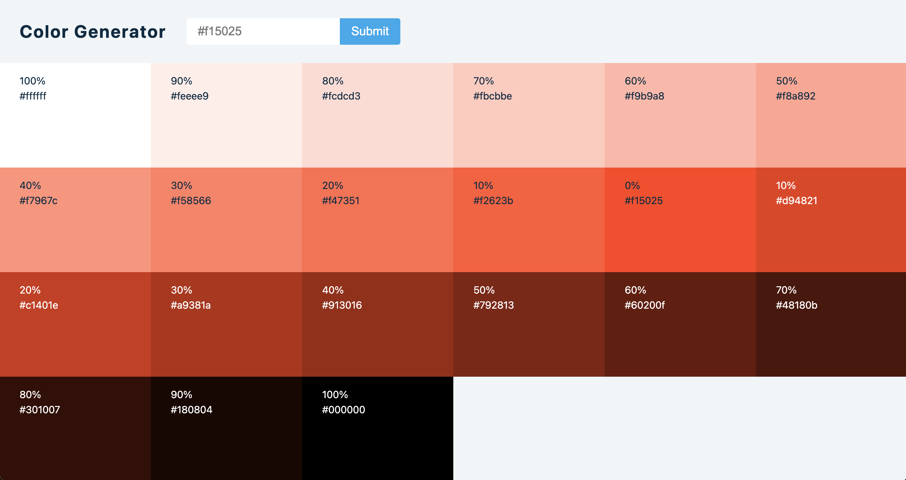

# Color Generator

<h1 align="center">
    
</h1>

- [`React`]()
- [`Javascript`]()
- [`CSS`]()

## Instalação e uso

Clone o repositório

```bash
$ git clone https://github.com/deniscoelho-js/color-generator.git

```

Siga os passos abaixo

```bash
# Instale as dependências
$ npm i or yarn

# Inicie o servidor
$ npm run dev or yarn dev
```

Agora você pode acessar [`localhost:3000`](http://localhost:3000) do seu navegador.
